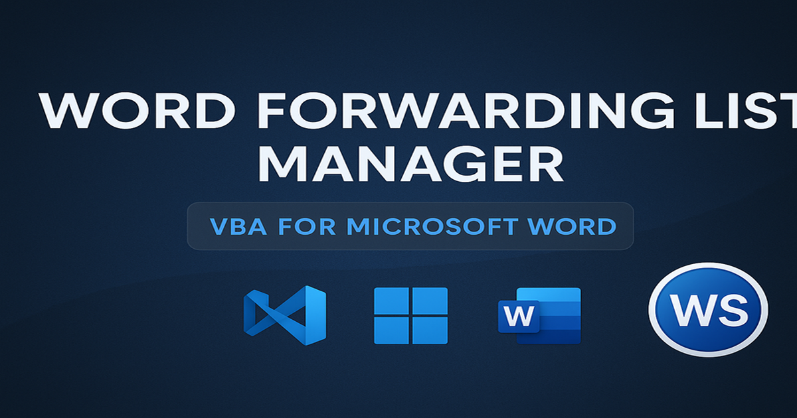

# 📄 Word Forwarding List Manager (VBA for Microsoft Word)



A complete Microsoft Word **VBA automation system** for generating and managing a persistent, hierarchical **"Copy forwarded to:"** list.

Very useful for Government Offices, Corporate Offices, Administrative Departments, and anywhere forwarding memos or orders is required.

Includes:

- 🔧 **Persistent dataset** stored in `%APPDATA%`
- 📝 **Advanced Editor UI** (Add / Edit / Delete / Move / Renumber)
- 📥 **Multi-select forwarding list insertion**
- ♻️ **Automatic autosave & auto-load**
- 📌 **Special rules** for ADM, Joint BDO, Gram Panchayat, Compliance entries
- 🧱 Modular code + event handlers + forms

---

## ⭐ Features Overview

| Feature | Description |
|--------|-------------|
| **Persistent Dataset** | Stored in `%APPDATA%\ForwardList\WordItemsDataset.txt` |
| **Advanced Editor** | Add, edit, move, delete, renumber |
| **Forwarding List Inserter** | Generates perfect numbering |
| **Automatic Save** | Saves dataset on Word close |
| **Automatic Load** | Loads dataset when Word starts |
| **Backups** | Timestamped backups for safety |
| **Clean Architecture** | 1 Module, 1 Class, 3 Forms |

---

## 📦 Directory Structure

```
word-forward-macros/
├─ src/
│  ├─ ModuleForwardList.bas
│  ├─ AppEventHandler.cls
│  ├─ UserForm1.frm
│  ├─ UserForm2.frm
│  └─ AdvancedEditorForm.frm
├─ assets/
│  ├─ banner_1200x630.png
│  └─ ws_logo.png
├─ README.md
└─ LICENSE
```

---

## 🚀 Quick Installation

1. Open Word → **Alt + F11**
2. Insert → **Module** → paste content of `ModuleForwardList.bas`
3. Insert → **Class Module** → rename to: **AppEventHandler**
4. Insert → **UserForms**  
   Create:  
   - UserForm1  
   - UserForm2  
   - AdvancedEditorForm  
5. Set **all required control properties** (listed below)
6. Save → Restart Word
7. Run:

```
InitAppEventHandler
```

---

## 🟦 UserForm1 — Selection Form

### Controls:

| Type | Name | Properties |
|------|------|------------|
| ListBox | `ListBox1` | MultiSelect = `fmMultiSelectMulti` |
| CommandButton | `OKButton` | Caption = OK |
| CommandButton | `CancelButton` | Caption = Cancel |

### Required in code:

```
ListBox1.ColumnCount = 2
ListBox1.ColumnWidths = "320 pt;0 pt"
```

---

## 🟩 UserForm2 — ADM Options

### Controls:

| Type | Name | Properties |
|------|------|------------|
| ListBox | `ListBox2` | MultiSelect = `fmMultiSelectMulti` |
| CommandButton | `CommandButton3` | Caption = OK |
| CommandButton | `CommandButton4` | Caption = Cancel |

---

## 🟥 AdvancedEditorForm — Main Editor UI

### Required Controls:

| Type | Name | Properties |
|------|------|------------|
| ListBox | `ListBox1` | MultiSelect = `fmMultiSelectMulti`<br>ColumnCount = 2<br>ColumnWidths = "320 pt;0 pt" |
| TextBox | `txtInline` | Single-line |
| Label | `lblStatus` | Caption="" |
| CommandButtons | `btnAdd`, `btnEdit`, `btnDelete`, `btnMoveUp`, `btnMoveDown`, `btnSaveOrder`, `btnRefresh`, `btnClose` | — |

---

## ✏ Example Layout

```
+--------------------------------------------------------------+
| Advanced Editor                                              |
| +----------------------------------------------------------+ |
| | ListBox1 (key - value)                                   | |
| +----------------------------------------------------------+ |
| txtInline: [..............................................]  |
| lblStatus: (Loaded X items.)                                 |
|                                                              |
| [Add] [Move Up] [Move Down] [Delete] [Apply Edit]            |
| [Save Order] [Refresh] [Close]                               |
+--------------------------------------------------------------+
```

---

## 📄 Forwarding List Generator

Run:

```
ShowSelectionFormAndInsert
```

Inserts:

- ADM Options (Gen/Dev/LR/ZP)
- Joint BDO count
- Gram Panchayat number ranges
- To … For Compliance → individual entries
- Proper 1–N numbering

---

## 💾 Persistent Dataset

Location:

```
%APPDATA%\ForwardList\WordItemsDataset.txt
```

Backup format:

```
WordItemsDataset_backup_YYYYMMDD_HHMMSS.txt
```

Format:

```
key|value
```

---

## ❗ Troubleshooting

| Issue | Fix |
|-------|------|
| Inline edit not updating | Ensure ListBox1 ColumnCount = 2 |
| Nothing saves | Ensure class module name = **AppEventHandler** |
| Numbering wrong | Use **Save Order** button |
| Status label missing | Add `lblStatus` |

---

## ⭐ Contribute

Pull requests welcome.

---

## 📄 License

MIT License.

